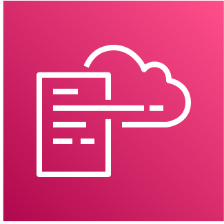

# 00. Infrastructure As Code and AWS CloudFormation

## What is Infrastructure As Code?

Infrastructure as Code (IaC) is an approach to automating the management and provisioning of infrastructure resources using machine-readable definition files rather than manually configuring infrastructure components.
It involves writing code in a high-level language, such as YAML, to define the desired infrastructure.
Infrastructure declared this way can then be version-controlled, tested, and deployed in a reliable and consistent way.
By defining IaC, developers and operations teams can collaborate more effectively and ensure that infrastructure is consistent across all environments.

## What is AWS CloudFormation?

  

AWS CloudFormation is a service provided by Amazon Web Services (AWS) that allows users to define and deploy parameterized IaC templates into your AWS account.
Each template is capable of managing large collections of interdependent AWS resources, including EC2 instances, S3 buckets, SQS queues, RDS databases and so on.

Terraform by Hashicorp is a platform-independent alternative to AWS CloudFormation.

## What are Custom Resources?

  

Custom Resources are a feature of AWS CloudFormation that allow users to extend CloudFormation functionality by adding custom code to their templates.
This feature enables users to define new resource types, backed by serverless AWS Lambda functions, that are not natively supported by AWS CloudFormation.
Developers can define the code that will be executed when the Custom Resource is created, updated or deleted.

## Why is this important?

  

The Venafi Ecosystem team is tasked with making the consumption of Venafi services as frictionless as possible.
Imagine a Cloud Native company who is both a customer of AWS and a user of TLS Protect Cloud (TLSPC).
They need to mint certificates via TLSPC **before** activating their AWS compute resources.
As such, TLSPC is a deep-rooted dependency of their own infrastructure.
The use of Custom Resources to represent TLSPC capabilities allows them to treat TLSPC as an extension of AWS, ensuring that policy-enforced X.509 certificates are delivered at the point of need, using familiar tools and best practice.

Next: [Main Menu](../README.md) | [01. Requirements, Terminology and Caveats](01-requirements-terminology-and-caveats/README.md)
